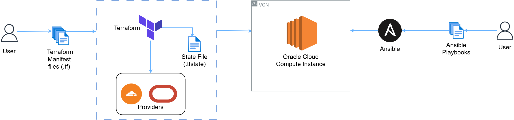

# Project Overview
This repository covers the infrastructure-as-code (IAC) configuration files used to setup my personal website.  The webpage files can be found in the following repository: https://github.com/WanderingShibe/Static-page-code

## Tools Used

The main objective of this projects was to implement IAC principles throughout, limit the use of GUI for configuration as much as possible. Although the scope of the project is small, and can easily be done with a GUI, learning how to automate infrastructure deployment at scale is useful. 

The following are the tools used for this projects:

- Terraform
	- Configures all the Oracle Cloud infrastructure and the necessary networking for my computer instance to interact with the internet.
- Ansible
	- Configures new users, the NGINX webserver and syncs all the webpage files from my local machine.

## Project Diagram
Below is a graphical representation of how to project is intended to be structured.

